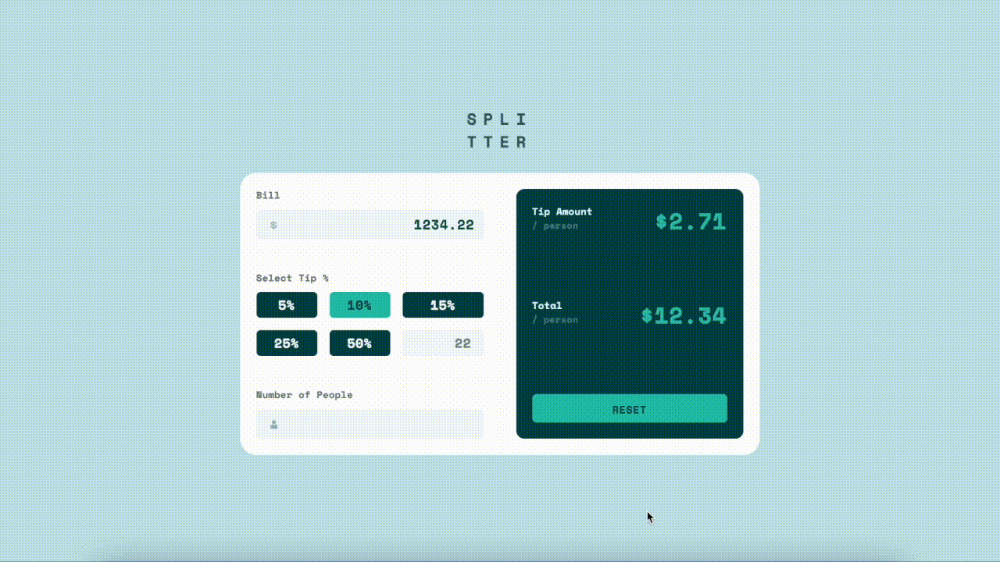

# Frontend Mentor - Tip calculator app solution

This is a solution to the [Tip calculator app challenge on Frontend Mentor](https://www.frontendmentor.io/challenges/tip-calculator-app-ugJNGbJUX). Frontend Mentor challenges help you improve your coding skills by building realistic projects.

## Table of contents

- [Overview](#overview)
  - [The challenge](#the-challenge)
  - [Screenshot](#screenshot)
  - [Links](#links)
- [My process](#my-process)
  - [Built with](#built-with)
  - [What I learned](#what-i-learned)
  - [Continued development](#continued-development)
  - [Useful resources](#useful-resources)
- [Author](#author)

**Note: Delete this note and update the table of contents based on what sections you keep.**

## Overview

### The challenge

Users should be able to:

- View the optimal layout for the app depending on their device's screen size
- See hover states for all interactive elements on the page
- Calculate the correct tip and total cost of the bill per person

### Screenshot

### Links

- [Solution URL](https://www.frontendmentor.io/solutions/css-grid-react-redux-jsx-BWaIEENU9)
- [Live Site URL](https://split-the-tip.netlify.app/)

## My process

### Built with

- Flexbox
- CSS Grid
- Mobile-first workflow
- [React](https://reactjs.org/) - JS library

### What I learned

I became more familiar with ReactJs by working on this project. this project gave me a better understanding of state and the different ways to bypass React's one direction data flow. Using redux allowed me to create a store that the components could later pull from, and where state changes where reflected throughout.

### Continued development

Going forward I wold like to increase my use of Redux stores for state management and find different CSS libraries that can speed up design.

### Useful resources

- [React Redux (with Hooks) Crash Course](https://www.youtube.com/watch?v=9jULHSe41ls) - This helped me understand the basics of Redux.

## Author

- Website - [Cliff Jean](https://www.cliffjean.com)
- Frontend Mentor - [@yourusername](https://www.frontendmentor.io/profile/yourusername)
- Twitter - [@Jeanius001](https://www.twitter.com/jeanius001)

